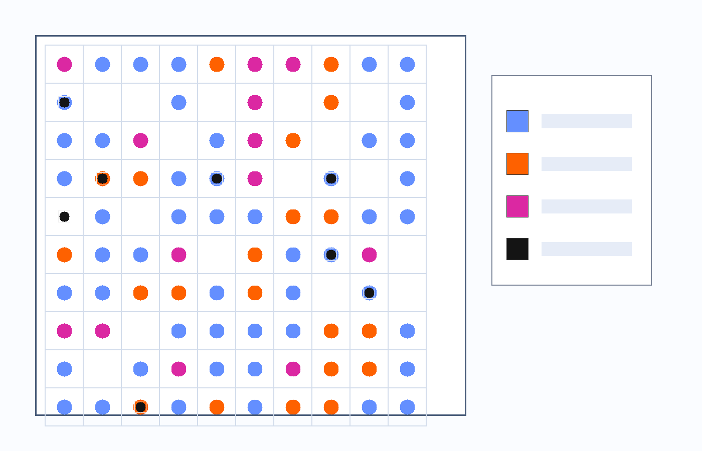
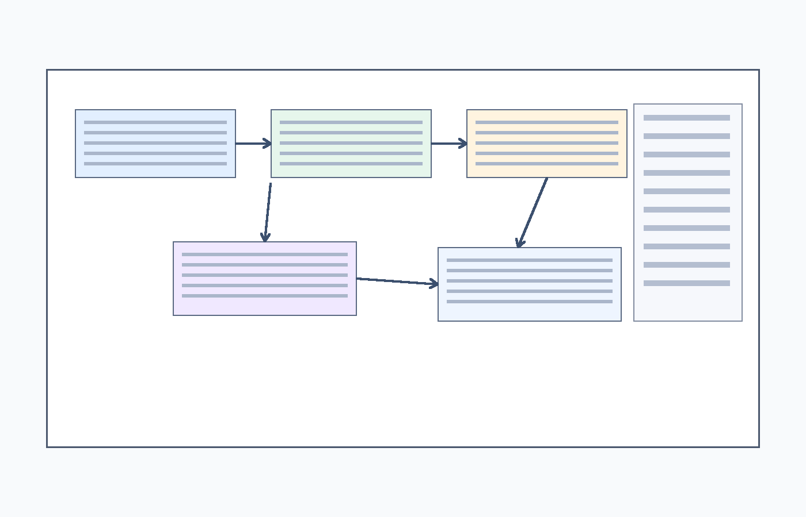
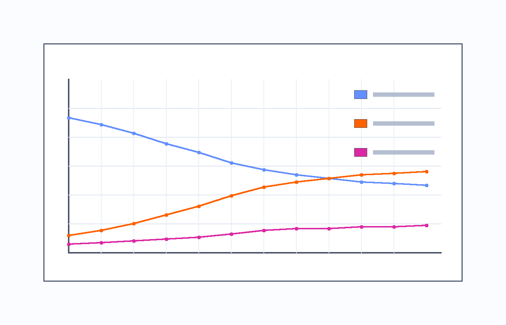

## Agenda

1. Agent-based modeling and Mesa
2. Generative ABM emergence
3. What and why Mesa-LLM
4. Related work comparisons
5. Architecture and core modules
6. Case study: Epstein civil violence
7. Portability example: Sugarscape G1MT
8. Cautions, conclusion, and Q&A

## What Is Agent-Based Modeling, and What Is Mesa?

- **Agent-based modeling (ABM)** simulates system-level outcomes from interactions among individual agents.
- It is useful when behavior, heterogeneity, and local interaction matter.
- **Mesa** is an open-source ABM framework in Python with strong fit to the PyData ecosystem.

```{=html}
<div style="display:grid; grid-template-columns: repeat(3, 1fr); gap:0.8em; margin-top:1.0em; font-size:0.72em; line-height:1.2;">
  <div style="border:1px solid #d6e1ef; border-radius:10px; padding:0.8em 0.7em; background:#f9fbff; text-align:center;">
    <div style="font-size:1.5em; font-weight:700; color:#005BBB;">3,473</div>
    <div style="font-weight:600;">GitHub stars</div>
    <div>Mesa repository as of March 2026</div>
  </div>
  <div style="border:1px solid #d6e1ef; border-radius:10px; padding:0.8em 0.7em; background:#f9fbff; text-align:center;">
    <div style="font-size:1.5em; font-weight:700; color:#005BBB;">v3.5.0</div>
    <div style="font-weight:600;">latest release</div>
    <div>published February 2026</div>
  </div>
  <div style="border:1px solid #d6e1ef; border-radius:10px; padding:0.8em 0.7em; background:#f9fbff; text-align:center;">
    <div style="font-size:1.5em; font-weight:700; color:#005BBB;">41,881</div>
    <div style="font-weight:600;">PyPI downloads</div>
    <div>last month on PyPIStats</div>
  </div>
</div>

<div style="font-size:0.48em; margin-top:0.8em; color:#5b6b7a;">
Sources: GitHub API for <code>mesa/mesa</code> repository stars and latest release, PyPIStats recent downloads for package <code>mesa</code>.
</div>
```

## What Is Generative Agent-Based Modeling, and Why Now?

- **Generative ABM (GABM)** uses LLMs or related generative models inside agents for reasoning, communication, planning, and action selection.
- It has emerged in the last few years as LLMs became stronger at language-grounded decision support.
- This opens new modeling space for negotiation, explanation, memory, and adaptive behavior.

```{=html}
<div style="display:flex; align-items:center; justify-content:center; gap:1.0em; margin-top:1.2em; font-size:0.78em; text-align:center;">
  <div style="padding:0.8em 1.0em; border:1px solid #d6e1ef; border-radius:10px; background:#f9fbff; min-width:180px;">
    <div style="font-weight:700; color:#005BBB;">Classic ABM</div>
    <div>rules, thresholds, probabilities</div>
  </div>
  <div style="font-size:1.3em; color:#005BBB;">→</div>
  <div style="padding:0.8em 1.0em; border:1px solid #d6e1ef; border-radius:10px; background:#f9fbff; min-width:180px;">
    <div style="font-weight:700; color:#005BBB;">LLM Agents</div>
    <div>reasoning, dialogue, planning</div>
  </div>
  <div style="font-size:1.3em; color:#005BBB;">→</div>
  <div style="padding:0.8em 1.0em; border:1px solid #d6e1ef; border-radius:10px; background:#f9fbff; min-width:180px;">
    <div style="font-weight:700; color:#005BBB;">GABM</div>
    <div>generative cognition inside simulation</div>
  </div>
</div>
```

## What Is Mesa-LLM, and Why This Project?

- **Mesa-LLM** is a Mesa extension for LLM-powered agents rather than a replacement for Mesa itself.
- It keeps Mesa's core execution model and adds modular cognition:
  - reasoning
  - memory
  - bounded tool use
  - recording and analysis
- The project exists to lower friction for Mesa users who want to study language-mediated behavior in ABMs.

## Related Work I: Classic ABM Frameworks and LLM Integration

```{=html}
<div style="font-size:0.54em; line-height:1.12;">
  <table>
    <colgroup>
      <col style="width: 11%;">
      <col style="width: 16%;">
      <col style="width: 10%;">
      <col style="width: 23%;">
      <col style="width: 10%;">
      <col style="width: 30%;">
    </colgroup>
    <tbody>
      <tr class="even">
        <th>Framework</th>
        <th>Language / ecosystem</th>
        <th>Native LLM layer</th>
        <th>Typical integration path</th>
        <th>Friction</th>
        <th>Research fit (LLM agents)</th>
      </tr>
      <tr class="odd">
        <td>NetLogo</td>
        <td>NetLogo + JVM</td>
        <td>No</td>
        <td>Python extension (<code>py:*</code>) or external API bridge</td>
        <td>Medium</td>
        <td>Good for rapid prototypes; more glue code for complex LLM stacks</td>
      </tr>
      <tr class="even">
        <td>Repast Simphony</td>
        <td>Java/Groovy</td>
        <td>No</td>
        <td>Java HTTP/SDK clients, custom agent logic</td>
        <td>Medium</td>
        <td>Strong for Java-heavy pipelines</td>
      </tr>
      <tr class="odd">
        <td>AnyLogic</td>
        <td>Java-based modeling + optional Python</td>
        <td>No</td>
        <td>Java customization + Pypeline/Python workflows</td>
        <td>Medium</td>
        <td>Strong for enterprise workflows, less ABM-LLM-specific scaffolding</td>
      </tr>
      <tr class="even">
        <td>GAMA</td>
        <td>DSL + Java extensions</td>
        <td>No</td>
        <td>Plugins/skills/extensions + external service calls</td>
        <td>Medium-High</td>
        <td>Flexible, but LLM stack is user-assembled</td>
      </tr>
      <tr class="odd">
        <td>MASON</td>
        <td>Java library</td>
        <td>No</td>
        <td>Direct Java SDK/HTTP integration in agent code</td>
        <td>Medium</td>
        <td>Lightweight, code-centric experimentation</td>
      </tr>
      <tr class="even">
        <td>Mesa (+Mesa-LLM)</td>
        <td>Python / PyData</td>
        <td><strong>Yes (via Mesa-LLM)</strong></td>
        <td>Native Python LLM libs + <code>LLMAgent</code> abstraction</td>
        <td>Low-Medium</td>
        <td>Fast iteration for ABM + LLM with modular components</td>
      </tr>
    </tbody>
  </table>
</div>
```

<div style="font-size:0.50em;">
Sources: NetLogo Python extension (<https://docs.netlogo.org/py.html>), Repast docs (<https://repast.github.io/>), AnyLogic docs (<https://anylogic.help/>), GAMA docs (<https://gama-platform.org/wiki/Home>), MASON docs (<https://cs.gmu.edu/~eclab/projects/mason/docs/>), Mesa docs (<https://mesa.readthedocs.io/>).
</div>

## Related Work II: Emerging GABM Frameworks vs Mesa-LLM

```{=html}
<div style="font-size:0.55em; line-height:1.12;">
  <table>
    <colgroup>
      <col style="width: 11%;">
      <col style="width: 16%;">
      <col style="width: 20%;">
      <col style="width: 18%;">
      <col style="width: 12%;">
      <col style="width: 23%;">
    </colgroup>
    <tbody>
      <tr class="even">
        <th>Framework</th>
        <th>Primary goal</th>
        <th>Simulation abstractions</th>
        <th>LLM orchestration style</th>
        <th>Scale orientation</th>
        <th>Reproducibility / tooling</th>
      </tr>
      <tr class="odd">
        <td>Concordia</td>
        <td>Generative social simulation</td>
        <td>Environment/game-master + agent stacks</td>
        <td>Bring-your-own LLM in scenario-driven sims</td>
        <td>Small-to-medium rich scenarios</td>
        <td>Open codebase and configurable scenarios</td>
      </tr>
      <tr class="even">
        <td>AgentSociety</td>
        <td>City/society-scale LLM social simulation</td>
        <td>Data/text/rule environments + social agents</td>
        <td>LLM-driven agents with distributed execution</td>
        <td>Explicit large-scale orientation</td>
        <td>Built-in evaluation tooling and engineering stack</td>
      </tr>
      <tr class="odd">
        <td>GPLab</td>
        <td>LLM-based policy/social system simulation</td>
        <td>Multi-subsystem social modeling components</td>
        <td>LLM-mediated behavior in policy labs</td>
        <td>Medium-to-large policy experiments</td>
        <td>Open framework with benchmark-style orientation</td>
      </tr>
      <tr class="even">
        <td>Mesa-LLM</td>
        <td>Mesa-compatible generative ABM extension</td>
        <td>Standard Mesa model/agent flow + modular cognition</td>
        <td><code>LLMAgent</code> + pluggable reasoning/memory/tools</td>
        <td>From toy to moderate scale; parallel stepping support</td>
        <td>ABM-centric modularity + recording/analysis support</td>
      </tr>
    </tbody>
  </table>
</div>
```

- Positioning: choose by research objective. Mesa-LLM favors ABM ecosystem continuity and modular experimentation rather than replacing ABM workflows.

<div style="font-size:0.50em;">
Sources: Concordia (<https://github.com/google-deepmind/concordia>, <https://arxiv.org/abs/2312.03664>), AgentSociety (<https://arxiv.org/abs/2502.08691>, <https://github.com/tsinghua-fib-lab/agentsociety>), GPLab (<https://www.jasss.org/28/3/3.html>, <https://github.com/VincentG57/gplab>), Mesa-LLM (<https://github.com/mesa/mesa-llm>).
</div>

## Architecture Overview

```{mermaid}
flowchart LR
    A["Model.step()"] --> B["AgentSet.shuffle_do('step')"]
    B --> C["LLMAgent.generate_obs()"]
    C --> D["Reasoning.plan()/aplan()"]
    D --> E["ToolManager executes selected tool calls"]
    E --> F["State and environment updates"]
    F --> G["Memory and recording updates"]
```

- Same Mesa stepping pattern, with cognition modularized inside agents.

## Core Modules

```{=html}
<div style="font-size:0.70em; line-height:1.15;">
  <table>
    <colgroup>
      <col style="width: 34%;">
      <col style="width: 66%;">
    </colgroup>
    <tbody>
      <tr class="even">
        <th>Module</th>
        <th>Role</th>
      </tr>
      <tr class="odd">
        <td><code>ModuleLLM</code></td>
        <td>Provider/model abstraction plus sync/async generation</td>
      </tr>
      <tr class="even">
        <td><code>ReAct</code> / <code>CoT</code> / <code>ReWOO</code></td>
        <td>Pluggable reasoning strategies</td>
      </tr>
      <tr class="odd">
        <td><code>STLTMemory</code> / <code>EpisodicMemory</code></td>
        <td>Context retention and memory shaping</td>
      </tr>
      <tr class="even">
        <td><code>@tool</code> + <code>ToolManager</code></td>
        <td>Bounded executable action space</td>
      </tr>
      <tr class="odd">
        <td>Parallel stepping + recording</td>
        <td>Performance and traceability support</td>
      </tr>
    </tbody>
  </table>
</div>
```

## Case Setup: Epstein Civil Violence

- Canonical ABM context: citizens and cops under unrest dynamics.
- Core model logic remains grounded in grievance, risk, thresholds, and arrest dynamics.
- Why this case: clear comparison between fixed-rule and language-mediated decision behavior.

## What Mesa-LLM Changes in Epstein

- Citizens and cops become `LLMAgent`-based actors with role-specific tools.
- Decisions are generated as language plans and executed through tool calls.
- Reasoning remains bounded by observation, internal state, and available actions.

```python
# Sketch from the Epstein model setup
plan = self.reasoning.plan(
    obs=observation,
    selected_tools=["change_state", "move_one_step"]
)
self.apply_plan(plan)
```

## Epstein Outputs (Static Artifacts)

::: columns
::: {.column width="33%"}
{width="100%"}
:::

::: {.column width="33%"}
{width="100%"}
:::

::: {.column width="33%"}
{width="100%"}
:::
:::

- Static artifacts are used to keep presentation flow reliable.

## Portability Example: Sugarscape G1MT (Brief)

- Demonstrates that the same Mesa-LLM architecture transfers beyond civil violence.
- Spatial-resource dynamics with LLM-guided trader decisions:
  - resource harvesting under constraints
  - local interactions and trading behavior
- Takeaway: portability across distinct socio-spatial modeling contexts.

## Methodological Cautions

- Stochastic trajectories require repeated-run interpretation.
- Model/provider choice can materially affect outcomes.
- Prompt design and tool definitions influence behavior.
- Cost and latency matter for larger agent populations.
- Reproducibility guardrails:
  - prompt/model version logging
  - repeated-run comparisons
  - archived recording artifacts

## Conclusion

1. Mesa-LLM preserves Mesa's simulation backbone.
2. Agent cognition is modular: reasoning, memory, and tools.
3. Framework choice should follow research goals; Mesa-LLM is a strong fit when ABM workflow continuity matters.

## Q&A and Community

### Likely Q&A Anchors

- "Does this replace theory with black boxes?"
  - No. Theory still defines environment, constraints, and allowed actions.
- "How reproducible are runs?"
  - Use controlled prompts, model/version logs, repeated runs, and recording outputs.
- "Why not stay rule-based?"
  - Rule-based ABMs remain valid; Mesa-LLM is useful when communication and interpretation matter.

### Join Us

- Matrix: <https://matrix.to/#/#mesa-llm:matrix.org>
- Discussions: <https://github.com/mesa/mesa-llm/discussions>
- Repository: <https://github.com/mesa/mesa-llm>
